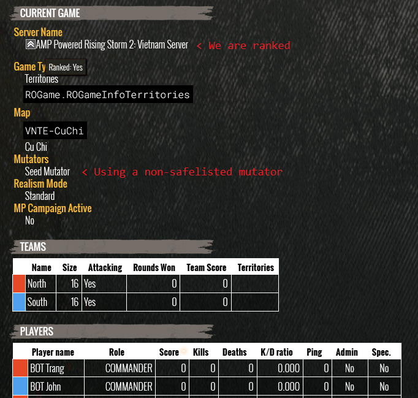

# RS2-Ranked-Patch
Working as of `9/4/26`

Patch performed on the [8/27/26](https://steamdb.info/changelist/38385728/) version of the [dedicated server](https://steamdb.info/app/418480/) (md5: `e90d353bbfed9f1a9a58646c8981aae8`)

### Description
Makes Rising Storm 2: Vietnam servers that use non-safelisted mutators ranked.

### Legal
This patch is for educational and research use only. Use of this patch violates the [RS2 EULA](https://store.steampowered.com//eula/418460_eula_0) provisions that prohibit disassembling or modifying game files. I make available no automated tools or guides to disassemble or modify game files.

### Patches
---
ORIGINAL:
```
140ad5d9b 0f 85 a1        JNZ        LAB_140ad5e42
          00 00 00
```
PATCHED:
```
140ad5d9b 48 e9 a1        JMP        LAB_140ad5e42
          00 00 00
```
DIFF:
```
Diff address range 215 of 696.
Difference details for address range: [ 140ad5d9b - 140ad5da0 ]

Byte Diffs : 
    Address    Program1  Program2
    140ad5d9b    0x0f       0x48
    140ad5d9c    0x85       0xe9

Code Unit Diffs : 

    Program1 rs2 patch:/VNGame_original.exe :
            140ad5d9b - 140ad5da0    JNZ 0x140ad5e42
                                     Instruction Prototype hash = 34d3feb0

    Program2 rs2 patch:/VNGame_PATCHED.exe :
            140ad5d9b - 140ad5da0    JMP 0x140ad5e42
                                     Instruction Prototype hash = a0bf28bf

Reference Diffs : 

    Program1 rs2 patch:/VNGame_original.exe at 140ad5d9b :
        Reference Type: CONDITIONAL_JUMP  From: 140ad5d9b  Operand: 0  To: 140ad5e42  DEFAULT  Primary

    Program2 rs2 patch:/VNGame_PATCHED.exe at 140ad5d9b :
        Reference Type: UNCONDITIONAL_JUMP  From: 140ad5d9b  Operand: 0  To: 140ad5e42  DEFAULT  Primary
```
---
ORIGINAL:
```
 140ad5caf 0f 84 42        JZ        LAB_140ad5ef7
           02 00 00
```
PATCHED:
```
 140ad5caf 48 e9 42        JMP       LAB_140ad5ef7
           02 00 00
```
DIFF:
```
Diff address range 214 of 696.
Difference details for address range: [ 140ad5caf - 140ad5cb4 ]

Byte Diffs : 
    Address    Program1  Program2
    140ad5caf    0x0f       0x48
    140ad5cb0    0x84       0xe9

Code Unit Diffs : 

    Program1 rs2 patch:/VNGame_original.exe :
            140ad5caf - 140ad5cb4    JZ 0x140ad5ef7
                                     Instruction Prototype hash = f6b3d700

    Program2 rs2 patch:/VNGame_PATCHED.exe :
            140ad5caf - 140ad5cb4    JMP 0x140ad5ef7
                                     Instruction Prototype hash = a0bf28bf

Reference Diffs : 

    Program1 rs2 patch:/VNGame_original.exe at 140ad5caf :
        Reference Type: CONDITIONAL_JUMP  From: 140ad5caf  Operand: 0  To: 140ad5ef7  DEFAULT  Primary

    Program2 rs2 patch:/VNGame_PATCHED.exe at 140ad5caf :
        Reference Type: UNCONDITIONAL_JUMP  From: 140ad5caf  Operand: 0  To: 140ad5ef7  DEFAULT  Primary
```
---
### Proof of functionality

